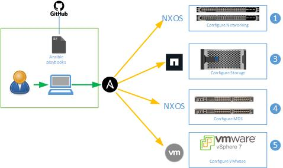

# Set up the Ansible execution environment

To execute various Ansible playbooks, a linux based system will need to be setup as described in the CVD with the packages listed at the following pages:

- Cisco NxOS: https://galaxy.ansible.com/cisco/nxos
- NetApp ONTAP: https://galaxy.ansible.com/netapp/ontap
- VMware: https://galaxy.ansible.com/community/vmware

# How to execute these playbooks?

  

Because a number of manual tasks need to be executed between running the Ansible playbooks, the CVD document should be used as a guide for running the playbooks. Commentary is included in the variable files to guide filling in those values.

The steps for setting up a FlexPod with Fibre Channel boot and FC-NVMe and NFS storage protocols are:

- Create a directory and clone the repository from Github with "git clone GIT_REPO_NAME".
- Fill in the variable files according to the CVD.
- Follow the manual steps in the CVD to set up the Nexus switches on the network and ssh into each switch.

### Setup Nexus Switches  
- Execute the Nexus playbook with "`ansible-playbook ./Setup_Nexus.yml -i inventory`" to setup the Nexus switches.
- Follow the manual steps in the CVD to add timezone information to the Nexus switches.

### Initial NetApp Storage configuration 
- Follow the manual steps in the CVD to get the NetApp ONTAP storage cluster on the network.
- Execute the NetApp ONTAP storage playbook with "`ansible-playbook -i inventory Setup_ONTAP.yml -t ontap_config_part_1`".
- Query the fibre channel and FC-NVMe LIFs WWPNs and add to the "group_vars/all.yml" file.

### UCS X-Series server configuration 
Configuration of the UCS X-Series servers can be completed utilizing the Terraform scripts included in this repository, or by following the manual steps in the CVD.

### Configurre MDS Switches  
- Query the ESXi host initiator WWPNs for both fibre channel and FC-NVMe interfaces and add to the "group_vars/all.yml" file.
- Follow the manual steps in the CVD to set up the MDS switches on the network and ssh into each switch.
- Execute the MDS playbook with "`ansible-playbook ./Setup_MDS.yml -i inventory"`.
- Follow the manual steps in the CVD to add timezone information to the MDS switches.

### NetApp Storage Configuration part 2
- Add the ESXi host initiator fibre channel WWPNs to "`vars/ontap_main.yml`"
- Execute the NetApp storage playbook with "`ansible-playbook -i inventory Setup_ONTAP.yml -t ontap_config_part_2`" to create and map the ESXi boot LUNs.

### VMware ESXi configuration 
- Follow the manual steps in the CVD to install VMware ESXi on the three host servers and assign IPs to those servers.
- Execute the ESXi playbook with " `ansible-playbook ./Setup_ESXi.yml -i inventory`" to setup the three ESXi hosts.
- Bring a vCenter into the environment by either installing vCenter on the first ESXi host according to the CVD or copying it in.
- Setup the vCenter and add the three ESXi hosts to it by executing "`ansible-playbook ./Setup_vCenter.yml -i inventory`".
- Follow the manual steps in the CVD to complete setting up vCenter and the ESXi hosts.

### NetApp Storage configuration part 3
- Execute the NetApp storage playbook with "`ansible-playbook -i inventory Setup_ONTAP.yml -t ontap_config_part_3`" to setup FC-NVMe.
- Execute the manual steps in the CVD to complete the FC-NVMe setup.
- Execute the NetApp ONTAP tools playbook with "`ansible-playbook -i inventory Setup_ONTAP_tools.yml`" to install the ONTAP Tools VM.

### Finalize installation
- Follow the manual steps in the CVD to finish setting up ONTAP tools and the rest of the FlexPod management cluster, including an optional Ansible setup of NetApp AIQUM.
- Execute the manual steps in the CVD to add the Cisco UCS Manager Plug-in for VMware vSphere Web Client.

The Ansible playbooks and CVD are structured in a way that a Fibre Channel Boot or Fibre Channel Boot with FC-NVMe FlexPod configuration can be setup by adjusting the variables. 

