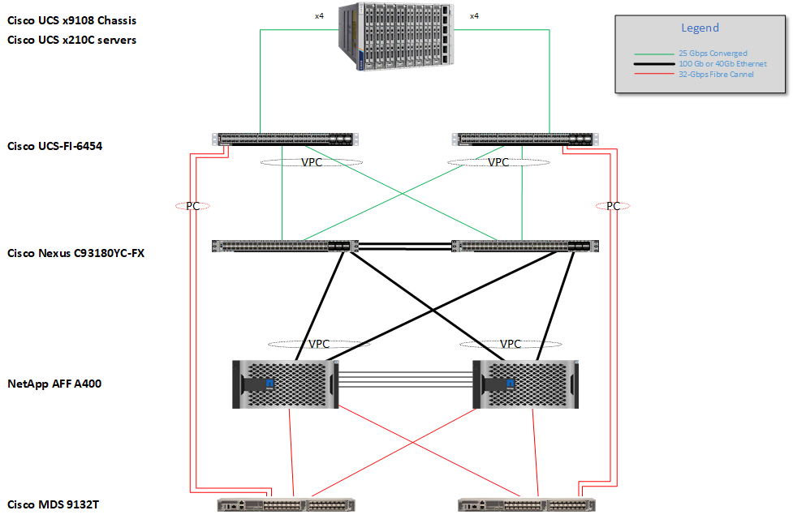
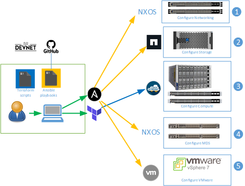
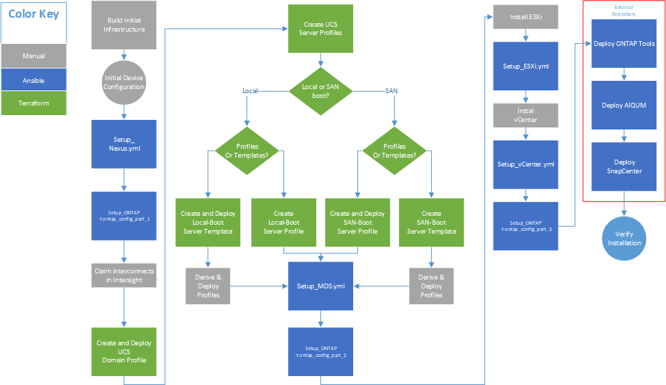

# Automation scripts for deploying FlexPod for EHR 

This repository for FlexPod contains Ansible playbooks and Terraform scripts to configure Cisco Nexus, Cisco UCS, Cisco MDS, NetApp ONTAP, VMware ESXi, and VMware vCenter. This repository can be used for setting up Cisco devices, NetApp ONTAP as well as VMware ESXi and vCenter as covered in the following Cisco Validated Design (CVD): 

[FlexPod for Epic EHR](https://www.cisco.com/c/en/us/td/docs/unified_computing/ucs/UCS_CVDs/flexpod_xseries_vmw_epic.html)

The CVD lays out the complete process for configuring the FlexPod using Ansible and Terraform. These scripts are intended to save time in setting up a working FlexPod.

  

## Automation 
The automation is split between Ansible and Terraform as shown in the following diagram:

- The Ansible scripts are contained in the Ansible Directory. 
- The Terraform scripts are in the Terraform directory.   

Each directory has a more detailed description of the steps required for completion. 

## Workflow  

The overall flow of automating the deployment using these tools is shown in the following diagram:

 

## External Repositories 

Repositories for installing NetApp Management Tools are maintained in the following repositories:

- [ONTAP Tools for VMware vSphere](https://github.com/NetApp-Automation/ONTAP-Tools-for-VMware-vSphere)
- [Active IQ Unified Manager](https://github.com/NetApp-Automation/NetApp-AIQUM) 
- [SnapCenter Plug-in for VMware vSphere](https://github.com/NetApp-Automation/SnapCenter-Plug-in-for-VMware-vSphere)
