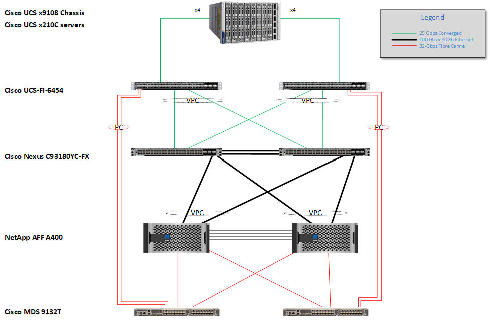
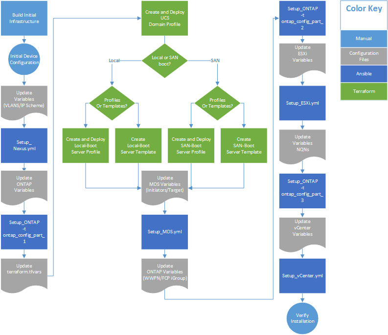

# Automation scripts for deploying FlexPod for EHR 

This repository for FlexPod contains Ansible playbooks and Terraform scripts to configure Cisco Nexus, Cisco UCS, Cisco MDS, NetApp ONTAP, NetApp ONTAP Tools for VMware, VMware ESXi and VMware vCenter. This repository can be used for setting up Cisco devices, NetApp ONTAP and associated NetApp tools as well as VMware ESXi and vCenter as covered in the following Cisco Validated Design (CVD): 

!!!! Insert CVD Link Here !!!!

The CVD lays out the complete process for configuring the FlexPod using Ansible. These playbooks are intended to save time in setting up a working FlexPod.

  

## Workflow  

The automation is split between Ansible and Terraform as shown in the following digram;

The Ansible scripts are contained in the Ansible Directory. Terraform scripts are in the Terraform directory. Each directory has a more detailed description of the steps required for completion. 

 
