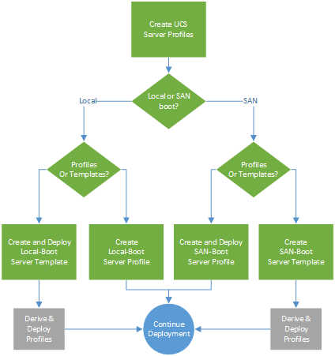

# FlexPod Converged Infrastructure setup for Epic EHR Terraform automation scripts  

## Automated Solution Deployment

### Installation

- Terraform 0.14.0 or later must be installed
- Access to the Terraform registry via the internet must be available

Clone the "!!!! Insert CVD Link Here !!!!"  repository to create a local copy of the scripts to work with.


`!!!! Insert CVD Link Here !!!!`


### Generate API keys

To use the Cisco Intersight provider, you need an API key, a secret key, and the Cisco Intersight endpoint URL. To generate the keys, follow these steps:
- Log in to https://www.intersight.com/.
- On the Settings screen, click the Settings menu.
- On the General page, choose API > API Keys > Generate API Key.
- On the Generate New API Key screen, enter the purpose for the API key and click Generate. The API key ID and RSA private key are displayed.
- Copy the API key.
- Save the private key information in a .pem file. Save it in a location in the downloaded repository.


### Workflows

We created multiple directories to logically separate each function. Each of these directories are stand-alone, and define Terraform configuration files, required modules, inputs and outputs as required. All you need to do is input your configuration in the *terraform.tfvar* file in each of the directories and then apply the terraform configuration in sequence.  
<br />
>NOTE: If you are not using a deployment method (e.g. creating templates) you can delete the unused folders. 




 
<br />
<br />

### Domain Profile 

`Create_DomainProfile`

This directory defines Terraform configuration for creating all the policies and profiles related to UCS Domain. 
You need to input Domain related configuration in terraform.tfvars file defined in this directory.

<br />


`Deploy_DomainProfile`

This directory defines Terraform configuration for applying actions like Deploy domain profile or Unassign already assigned domain profile. 
Action configuration can be defined in terraform.tfvars file defined in this directory. This action can also be performed manually.


<br />

### Server Profiles  

Apply Terraform configurations from **any one of the directories**. All directories create Pools, Policies and Profiles required for UCS Servers.  

#### Create Server Templates 

If you are configuring Fibre Channel SAN Boot in your EPIC stack, then configure each parameter required in `Create_SAN-Boot_Server_Templates/`.


If you are configuring Local (M.2) Boot in your EPIC stack, then configure each parameter required in `Create_Local-Boot_Server_Templates/` 

Once the templates are created, you must manually derive and apply Server Profiles


#### Create Server Profiles

If you are configuring Fibre Channel SAN Boot in your EPIC stack, then configure each parameter required in `Create_SAN-Boot_Server_Profiles/`.


If you are configuring Local (M.2) Boot in your EPIC stack, then configure each parameter required in `Create_Local-Boot_Server_Profiles/`. This directory defines Terraform configuration for associating server profiles with servers. 
You can change the configuration in terraform.tfvars file to Disassociate a server profile. 


<br />
<br />


### Execution
Once **all the required inputs are entered in terraform.tfvars file**, run the following commands in each directory
```
terraform init
```
This command will initialize the environment and download the Cisco Intersight Terraform provider to the .terraform folder.
```
terraform plan
```
This command will execute the script without committing any changes and give a list of all the resources that will be created. Examine the output of the plan execution for any warnings or errors.
```
terraform apply
```
This command will execute the plan and commit all the new resources or changes to the environment.

<br />
<br />


### Validate and Deploy
Once the Terraform script has completed, all the necessary policies and profiles for UCS Domain and Servers will appear in your Cisco Intersight management UI, shown in the Policies section and the Profiles section.

<br />

### Summary of commands to deploy infrastrcutre
<details><summary>Steps</summary>
<p>
Just to summarize, in each of the directories:
  <br />
(X) Chose the type of deployment (Templates or Profiles) you wish to use, and the boot method (SAN-boot or Local-Boot). Remove uneeded directories. 
  <br />
(X) Update "terraform.tfvars" file with required configuration
  <br />
(X) Run "Terraform commands" (init/plan/apply)
</p>
<br />
<br />
